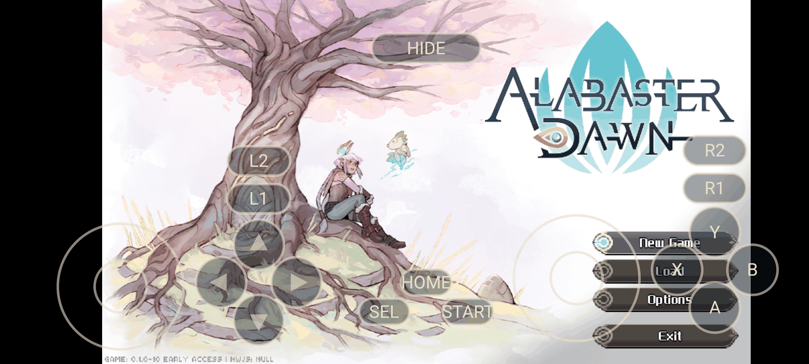
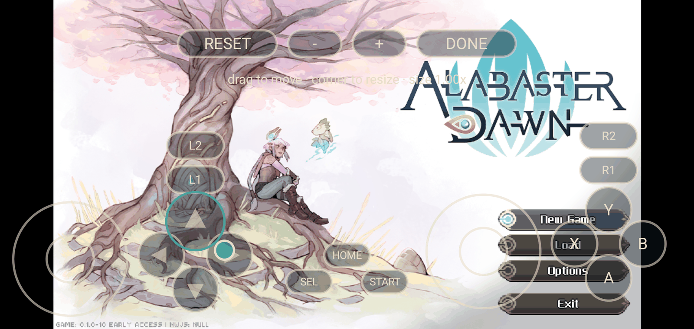
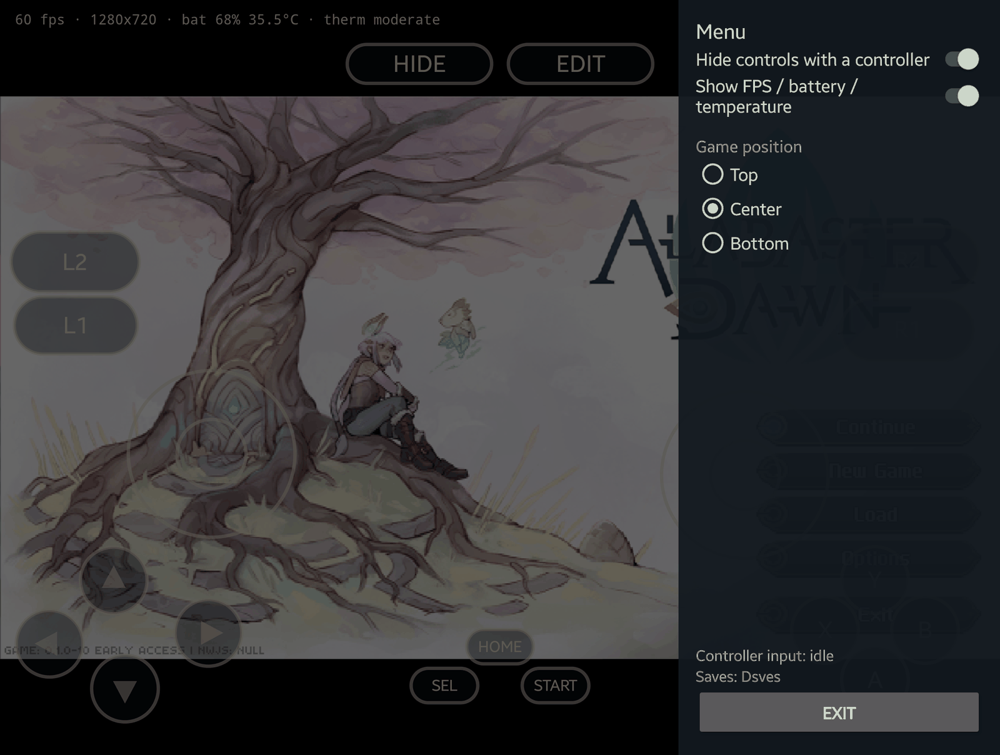
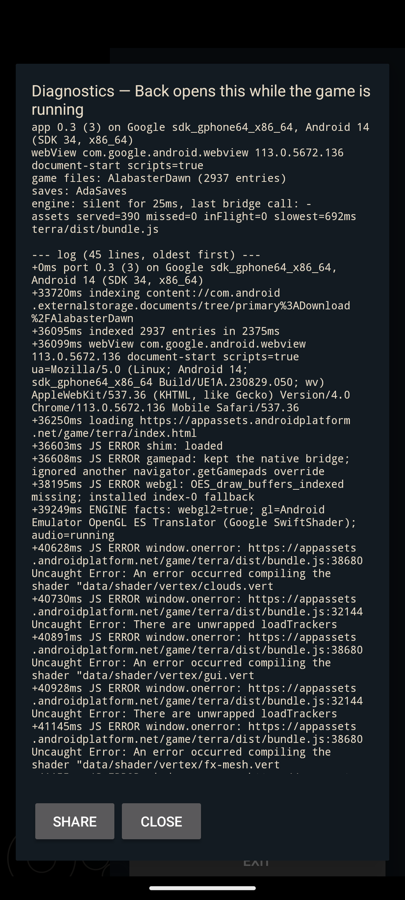

# Alabaster Dawn on Android — unofficial port + controller fix

Two independent pieces of work for [Alabaster Dawn](https://store.steampowered.com/app/3110760/)
(Radical Fish Games, Early Access):

1. **A native Android port** (`android/`) — runs the game in an Android WebView with no Wine, no
   Box64 and no NW.js, reading your own game files from a folder you pick, playing through a
   physical controller read natively from `InputDevice` **or the built-in on-screen pad**, and
   keeping saves in a second folder you pick, in the Steam build's own layout.
2. **A controller fix for the desktop build** (`fix/`) — repairs how the game decodes gamepads on
   Linux and inside Wine containers (GameNative / Winlator / Proton).

Plus the research notes (`FINDINGS.md`) and the test harness (`tools/`, `logs/`) that produced them.

| Setup screen | Running under the port | On-screen pad | Pad layout editor |
|---|---|---|---|
|  |  |  |  |





*Screenshots contain Alabaster Dawn artwork and text, © Radical Fish Games, shown for documentation.*

---

## Android port

### What works today

* Boots the unmodified game to its title screen — **no game file is ever edited**; everything is
  injected at document start and served from the APK.
* Game files are read through the **Storage Access Framework** from a folder you pick (read-only).
  The APK requests **no permissions at all**.
* Saves are written to a **second SAF folder** you pick, using the Steam layout
  (`Saves/Default/Save_ID_0000.save`, `Saves/Default/System.save`, `Saves/Backups/`, `Saves/Backups2/`),
  so a save folder can be copied in from the desktop and copied back out.
* Gamepad: Android `InputDevice` → W3C-standard gamepad for the engine. Left/right stick, d-pad,
  face buttons, shoulders, analog and digital triggers, start/select.
* **On-screen pad**: the same standard gamepad drawn over the game, for playing with no controller —
  both sticks, d-pad, A/B/X/Y, L1/R1, L2/R2, Select/Start/HOME, with a small toggle pill that hides
  the pad (the choice is kept). It feeds the *same* pad state as the hardware one, so the engine sees
  one standard pad; while a real controller is in use the whole overlay hides itself — controls *and*
  that pill row — and comes back after a minute of no controller input.
* **Pad layout editor**: an `EDIT` pill in the same row opens an editor — drag any control to move
  it, drag the selected control's corner handle to resize it, `-`/`+` to size the whole pad, `RESET`
  to restore the stock layout (`UNDO` while that reset is still unsaved) and `DONE` to save. The
  layout is kept in the app's prefs and, when a saves folder is picked, also written to
  `pad-layout.json` at its root, which wins on load so the layout travels with the saves folder.
  While the editor is open the pad publishes no gamepad at all, so the game falls back to keyboard.
* **A side menu on Back**: Back while the game runs opens a panel over it (the game keeps running
  behind) with a switch for whether a controller in use hides the overlay, a **Game position** choice
  (Top / Center / Bottom) for where the picture sits inside the black letterbox bands, a switch for
  an **FPS / battery / temperature** readout, a switch to **keep a log file with the saves**, two
  status lines (controller input, where saves go), the last thing the engine reported, and **Exit**.
  Back again, a tap on the dimmed area or Exit closes it; all four settings live in the app's prefs,
  and nothing is written into the game folder — the saves tree only ever gains the Steam `Saves/`
  layout, `pad-layout.json` and that log, all at its root.
* **Diagnostics without a PC**: the same panel opens the record — device, WebView version and
  capabilities, GL backend, folders, asset counters and the app's own log — readably on screen (a
  screenshot is already a usable report), shareable as text, and written to a file next to the app.
  The record is built for the failure this port actually meets on hardware nobody here owns: when the
  engine's loading bar stops, it names the resources still unfinished, grouped by kind, with the
  audio-decode callbacks counted; and when the page's own thread stops instead, it says so and names
  the file-system call it is stuck in. A line the engine repeats every frame while it is stuck
  collapses in place (`… There are unwrapped loadTrackers (x412)`), so the lines that name the cause
  are still in the record when the user opens the panel. With the log switch on, the same text is
  also kept as `ada-diagnostics.log` in the saves folder — the record survives a force-stop — and the
  switch turns itself off after the first boot that *completes*, so the default is a file for boots
  that fail and nothing for the ones that work. A frozen boot usually forces a restart, so the app
  does not start from an empty record: the newest lines of that file are carried back in behind a
  `--- previous session, carried from ada-diagnostics.log ---` marker, and the file also starts
  being written the moment **START** is tapped — a hang while the game's files are being read leaves
  the same evidence as a hang while they load. There is also a **Diagnostics** button on the setup
  screen, before the game starts.
* Resolution can be raised in-game: `640x360 / 960x540 / 1280x720 / 1920x1080 / 2560x1440`.
* Leaving the app pauses the game: the music stops and the loop stops burning CPU. An Android
  WebView never dispatches the page's `blur`/`focus` (which is how the engine knows it lost the
  foreground), so the port dispatches them on `onPause`/`onResume`.
* Immersive fullscreen, screen kept awake, renderer crashes recovered by rebuilding the WebView.

Verified end-to-end on **Samsung Galaxy S22 Ultra (SM-S908U1), Android 16 (API 36)**, with a
Switch Pro Controller: title screen, in-game input, save rotation (`Default` → `Backups` →
`Backups2`), `System.save` round-trip, and options persisted. The on-screen pad was verified on an
**Android 14 emulator**: it draws over the running game, the engine reports one connected standard
pad with *no* controller attached, a held stick and every button reach the engine with the expected
values, the d-pad steps the title menu and A opens the highlighted entry, the toggle hides/shows the
pad (persisted across a restart) and a controller event hides the controls until it goes quiet. The
later change that hides the pill row too (the whole overlay disappears while a controller is in use)
was verified on a **Galaxy Z Fold 7 (SM-F971B)**: the row stays hidden while controller events keep
arriving, a tap where it used to be is not swallowed, and the controls and the row both come back a
minute after the last event. The side menu was verified on the same Fold 7 (Android 17, API 37):
Back opens it through the predictive-back dispatcher (and `onBackPressed` covers older devices),
Back and a scrim tap close it with the WebView keeping focus (a gamepad event still reaches the port
afterwards), the overlay switch was driven both ways, the three positions measured
(`236…1612` Center / `0…1376` Top / `471…1847` Bottom), the readout's battery level, temperature and
thermal word matched `dumpsys battery` and `dumpsys thermalservice`, the engine was confirmed to keep
polling behind the open panel, and Exit plus a relaunch kept both switches and the position. The
emulator pass also covered the layout editor: the pad publishes nothing while editing, a dragged
control and a resized key reach the engine at their new geometry, the layout survives a restart, the
saves-folder `pad-layout.json` wins over the prefs copy, and `RESET`/`UNDO` flip as described.

The diagnostics hardening (2026-09-25) was verified on the same Android 14 emulator, back when
SwiftShader could not compile the engine's vertex shaders and the boot froze at 12 % of 1 755
resources — exactly the state these features exist for. The log file appeared at
`Download/AdaSaves/ada-diagnostics.log` and kept growing while the boot stayed stuck: it carried the
engine facts line, the `boot stall … (effect=301 shader=20 data=1082 …)` line, the ten shader
`JS ERROR` lines, and the engine's per-frame `There are unwrapped loadTrackers` line collapsed to
`(x10)` with the newest timestamp. Its header ended `; rewrite cached=40 hits=0 12861435/33554432
bytes`, and a CDP `location.reload()` moved that to `hits=40` with `served` growing 328 → 651 — the
12.7 MB bundle and the 38 other rewritten bodies came back from memory. Driving the engine's boot
tracker to complete over the same CDP connection produced `ENGINE boot: complete in 35000ms …`
followed, within the next 2 s tick, by `log file off: the game completed its first boot`, with
`log_to_saves=false` and no `log_to_saves_user_set` in the prefs and that line last in the file;
after tapping the switch on (setting `log_to_saves_user_set=true`), a second completed boot printed no
auto-off line and the switch stayed on across a force-stop and relaunch. The **shipped release
artifact** was then exercised the same way: `android/tools/release.sh`'s signed
`AlabasterDawn-Android-0.4.apk` was installed on that emulator over a debug uninstall (the keys
differ), granted the two folders from scratch through the picker, started, and it booted to the same
12 % stall while writing `app 0.4 (4) …` and `rewrite cached=40 hits=0 …` to the log file, with
`(x12)` visible in the collapsed repeat.

Two follow-ups came out of the first two reports from real devices, and both were measured the same
way on that emulator. Both reporters' panels turned out to be **fresh launches** — `game files: …
(not indexed)`, `assets: none served yet`, a two-line log — because a frozen boot forces a restart
before the panel can be read. So the record is now carried across restarts: on the setup screen with
the game never started, the panel read `--- log (202 lines, oldest first) ---`, the launch line, then
`--- previous session, carried from ada-diagnostics.log ---` and the newest 199 lines of the previous
file; a `force-stop` and relaunch reproduced the same, and a record carried over repeatedly keeps
**one** marker (counted in the file, `grep -c "previous session"` = 1). And the file now starts being
written when **START** is tapped: indexing a 3 000-entry tree took 2 119 ms, and the 2 s flush held
this session's `+3922ms indexing …` with `indexed 3000 entries` appearing only at `+5996ms` — i.e. a
hang while the game's files are being read now leaves a record on disk, which it previously did not.

The frozen boot of issue #1 (2026-09-26) turned out to be the game's own texture-slot table, and it is
fixed: each vertex shader declares `uniform vec2 u_texSlotCoords[TEX_SLOT_COUNT]` with 256 slots, which
costs a device whose `MAX_VERTEX_UNIFORM_VECTORS` is the GLES3 minimum of 256 **every** uniform vector
it has — so the shaders never compiled, `checkTrackers()` threw every frame and the loading bar stopped
for good. The shim now measures that budget before the first shader is requested, the port serves the
table the device can actually take (the game's own 256 wherever there is room, 192 at the floor, with
`gui.vert`'s second table packed into `vec4`s so the atlas keeps 192 slots instead of 96), and both the
shaders and the engine's own constant move together. On the same emulator that could not boot at all:
`0` shader errors and `ENGINE boot: complete in 6161ms` instead of `no progress for 8917499ms at 12.0%`.
The panel and the log now also carry the device's uniform budget and forward the engine's own
`console.error` lines — so a device that still cannot compile, or one that runs out of atlas slots,
says so in the record. See `FINDINGS.md` §10.9 for the measurements, including what the fix costs (64
fewer atlas slots per atlas on a floored device, out of the game's 256).

### Download

Grab `AlabasterDawn-Android-<version>.apk` from
[Releases](https://github.com/moronigranja/alabaster-android/releases) (allow "install unknown
apps" for your browser or file manager). Every release is signed by **this project's own release
certificate** — `CN=Alabaster Dawn Android port, O=moronigranja, C=BR`, SHA-256
`ab31dd8874bf28fb06c783c8df0d3f6abeec719240165605ce27070e676b9604` — so you can confirm what you
install:

```bash
apksigner verify --print-certs AlabasterDawn-Android-0.4.2.apk   # no SDK? keytool -printcert -jarfile …
```

The APK carries `assets/LICENSE` + `assets/NOTICE.md` inside, so the binary ships the notices it is
distributed under. Installing it over a build signed with a different key (a local debug build,
say) needs an uninstall first.

### Not in this milestone

* **Starting the game twice in the same app process can come up black.** Leaving the game (Back at
  the side menu, or Exit) and starting it again *without* clearing the app from recents can stop the
  second boot before the title screen with an unresponsive picture. It predates this release
  (reproduced on the v0.2 build) and the workaround is to swipe the app away from recents — or
  force-stop it — before starting again, which always boots. Your files are untouched either way.
* The on-screen pad's stick **clicks** (L3/R3) are not exposed, and its multi-finger handling has
  unit tests but no real two-thumb pass on a phone yet.
* The in-game **Load** list was not eyeballed (needs a manual save); everything underneath it —
  file naming, rotation, metadata, `mtime` — is verified.
* Performance is GPU-bound; see the ledger below before expecting 1080p.

### Requirements

* JDK 17, Android SDK with **platform 36** and **build-tools 36.0.0**.
* Phone or tablet on **Android 8.0+** (`minSdk 26`).
* A Bluetooth/USB controller, or the on-screen pad (no controller required).
* Your own copy of the game (Steam). Its files are **not** distributed here.

### Build and install

```bash
cd android
echo "sdk.dir=$ANDROID_HOME" > local.properties      # or point it at your SDK
./gradlew :app:assembleDebug
adb install -r app/build/outputs/apk/debug/app-debug.apk
```

Unit tests (gamepad state and overlay merge, pad layout and hit rules, the diagnostics ring and its
line collapsing, the asset-read accounting, the rewrite cache's byte budget, and the log-file rules):

```bash
cd android && ./gradlew :app:testDebugUnitTest
```

The diagnostics half of the injected shim (`assets/ada-shim.js`) is driven against a stub engine by
a Node test — no device, no browser, under a second:

```bash
node android/tools/test-shim-diagnostics.mjs
```

Publishing a signed release (maintainers): the release keystore lives **outside** the repo and is
wired through the gitignored `android/keystore.properties`; clones without that file still build,
but the release variant comes out unsigned.

```bash
keytool -genkeypair -keystore ~/.android/alabasterdawn-release.jks -alias alabasterdawn \
  -keyalg RSA -keysize 4096 -validity 10000 -dname "CN=Alabaster Dawn Android port, O=moronigranja, C=BR"
# then android/keystore.properties: storeFile / storePassword / keyAlias / keyPassword (chmod 600)

android/tools/release.sh                       # signed build + digest + signature check
android/tools/release.sh --upload --publish --notes docs/release-notes-0.4.2.md
```

`tools/release.sh` renames the shipped artifact to `AlabasterDawn-Android-<version>.apk` (never
`app-release-unsigned.apk`, never `app-debug.apk`) and runs the digest and signature checks on that
exact file. Back the keystore and `keystore.properties` up off-machine: losing them locks updates
on every device that installed a build signed with them.

### First run

Copy the game to the phone — the picked folder must contain a `terra/` child:

```bash
adb shell mkdir -p /sdcard/Download/AlabasterDawn
adb push "<steam>/steamapps/common/Alabaster Dawn/terra" /sdcard/Download/AlabasterDawn/terra
```

Optionally copy your desktop saves in (this is the import path):

```bash
adb shell mkdir -p /sdcard/Documents/AdaSaves
adb push "$HOME/.config/Alabaster Dawn/Saves" /sdcard/Documents/AdaSaves/
```

Then: **CHOOSE GAME FILES** → `Download/AlabasterDawn`, **CHOOSE SAVES FOLDER** →
`Documents/AdaSaves`, **START**. The first launch indexes the tree (~2 650 files, a few seconds);
afterwards both folders are remembered and it is one tap. The selected saves folder gains
`Saves/{Default,Backups,Backups2}` on first boot.

Exporting a save is a plain file copy, and the files are drop-in portable back to Steam.

### If the game does not boot

A device-only failure is silent by nature: no crash, no log, usually just the engine's loading bar
stopped at a few percent. The port therefore keeps its own record of what happened, and the record
can be read on the device itself:

* **Diagnostics** on the setup screen (before the game starts), or **Back → Diagnostics** while the
  game runs — including while the loading bar is stuck, which is exactly when it matters.
* The header carries the device, the Android version, the **WebView package and version**, whether
  the WebView supports document-start scripts, which GL backend the page got, the picked folders, the
  asset-path counters (`served / missed / inFlight / slowest`) and how long the engine has been quiet.
* The log below it names the failure: the shader that would not compile, the resources still
  unfinished when the bar stopped (grouped by kind, with the audio-decode callback counts), or the
  file-system call the page's own thread is stuck in.
* **Share** hands the whole record to any installed app as text and writes the same text to
  `Android/data/io.github.moronigranja.alabasterdawn/files/diagnostics-<epoch>.txt`. The side menu
  shows the last engine report inline, so a stuck boot announces itself without opening anything.
* **The record is also kept as a file** in the picked saves folder, `ada-diagnostics.log` (a whole
  snapshot, overwritten every 2 s while it is dirty), so a failure survives a force-stop, a reboot
  and a `adb`-less device — send that file instead of a screenshot. The side menu's **Keep a log
  file with the saves** switch controls it, on by default, and it switches itself off after the
  first boot that *completes*: the file is for the boots that fail. One tap on the switch, either
  way, ends that behaviour for good. Nothing deletes an existing log.
* **Restarting does not lose it.** The record is per-launch, and a freeze usually forces a restart
  before you can read the panel — so the newest lines of that file are read back at launch and shown
  above this session's, behind a `--- previous session, carried from ada-diagnostics.log ---`
  marker. The carried lines are 199 of them (half the ring) and this session's lines eventually
  scroll them out; send the file (or a screenshot) soon after the failure.
* **A hang while the game's files are being read is recorded too.** The file starts being written as
  soon as **START** is tapped, not when the game's page begins loading, so a port that stalls on a
  big or slow folder leaves the evidence on disk — `indexing …` and nothing after it.
* Everything in the record is also on logcat, tag `AdaPort`, if you do have a PC:
  `adb logcat -s AdaPort:I` (the raw lines: the on-screen/on-file record collapses a line the engine
  repeats every frame, logcat keeps every occurrence).

The panel is the shortest way to report a problem: open it and send the screenshot.

### Resolution and performance

Measured on the S22 Ultra (Snapdragon 8 Gen 1, Adreno 730), `gpubusy` sampling:

| In-game resolution | GPU busy | Frame rate |
|---|---|---|
| 640×360 | 54 % (52.9–54.3) | 59.9 fps sustained (p50 16.7 ms) |
| 960×540 | 91 % | 60 fps sustained |
| 1280×720 | 99.9 % (saturated) | 38–42 fps cool, 19–21 fps hot |

Thermals, not CPU, are the limit: the same 720p scene measured 42 fps cool and 19–21 fps with
`Thermal Status: 3` / 45 °C skin. Don't charge while playing; `640×360` is the safe default,
`960×540` the sharpest resolution that still holds 60.

### How it works (short)

* `WebViewAssetLoader` serves the picked tree in-process from `https://appassets.androidplatform.net/game/`;
  a tree index built once makes the game's ~1 240 per-boot `.flac` probes instant 404s. The few
  responses that are rewritten (the 12.7 MB bundle's resolution ladder, the option labels, the
  patched `.frag` shaders, the injected index) are then served from a byte-bounded `RewriteCache`
  instead of being read and rewritten again, and a fragment shader's paired `.vert` is read once per
  process rather than once per request; the diagnostics header reports both as
  `; rewrite cached=N hits=N bytes/max`.
* `WebViewCompat.addDocumentStartJavaScript` injects `assets/ada-shim.js` before the page's own
  scripts: a `require`/`nw` shim plus the device-specific workarounds the game needs on Android's
  WebView GL stack (no `OES_draw_buffers_indexed`, a dead shader attribute the Adreno driver
  rejects) and the resolution ladder.
* `AdaBridge` exposes the pad (`getGamepadJson()`) and the file calls used for saves; `FsBridge`
  maps the engine's `/saves` namespace onto the picked saves tree and keeps the Steam file names
  exactly (create-or-overwrite, never a deduplicated `Save_ID_0000 (1).save`).
* `SideMenuView` is the Back-opened panel (a scrim plus a right-edge panel whose descendants are
  made unfocusable, so the WebView keeps focus and the engine's loop is never blurred). It only
  reports taps: the Activity owns the four settings (`ViewAlign` is the picture position and its
  wire format, pure Kotlin and unit-tested) and the shim reads them once per engine frame from
  `getViewAlign()`/`getStatsEnabled()`, applying the position to the canvas and painting the
  readout. `Telemetry` is the only thing that reads the phone: the sticky battery broadcast plus
  `PowerManager.getCurrentThermalStatus()`, cached for 5 s and only sampled while the readout is on.
* `GamepadState` is the single JSON producer: the physical pad (`Gamepad`, from `KeyEvent`/
  `MotionEvent`) and the on-screen pad both write into it, and it publishes one merged W3C standard
  pad. `OnScreenPadModel` holds the pad's layout and pointer rules (pure Kotlin, unit-tested) and
  `OnScreenPadView` draws it and turns touches into model calls. `PadLayout` is the persisted
  override set (its JSON, pure Kotlin) and `PadLayoutStore` keeps the two copies — the app prefs and
  `pad-layout.json` in the picked saves folder.
* `Diag` is the app's own bounded log and its frame clock: `getGamepadJson()` is called exactly once
  per engine frame, so its silence means the page's JS thread stopped, which is a *different* failure
  from a page waiting for an asset read that never returns. A line that repeats immediately — what a
  fault thrown once per frame looks like — is collapsed in place to `(xN)` with the newest timestamp,
  so the ring keeps the context around a fault instead of only its last seconds, while an attached
  sink still sees every raw occurrence (logcat keeps full fidelity). A 2 s watchdog on the main thread
  reports that silence together with the bridge call in flight, `AssetTracker` (pure Kotlin,
  unit-tested) reports asset reads that have been unfinished for seconds, and the shim's own
  `watchBoot` samples the engine's boot tracker on a timer — not on a frame, because during BOOTING
  the engine renders without running the game loop — naming the resources still pending, grouped by
  kind, plus the `decodeAudioData` callback counts (the one load path in this engine that can stay
  unfinished without an error: a sound finalizes from its success callback alone).
* `ShaderSlots` (pure Kotlin, unit-tested) is the rule behind the served shader text: how big a
  `TEX_SLOT_COUNT` the device's reported vertex-uniform budget can carry, and when `gui.vert`'s two
  tables have to be packed into `vec4`s — the fix for the frozen boot of issue #1.
* `DiagnosticsDialog` renders that record and hands it to any text share target; `LogFile` (pure
  Kotlin, unit-tested) is the name and the rules behind the saves-folder copy — the same `snapshot`
  text, written on its own thread at most every watchdog tick, switched off by itself after a boot
  completes unless the user has touched the switch, and read back at the next launch (its stamped
  lines, and only those) so a restart carries the previous record instead of showing an empty panel.
* `FINDINGS.md` documents the measurements, the dead ends and the reason for every patch.

---

## Desktop controller fix

The game decodes a gamepad that Chromium reports with `mapping != "standard"` using a raw
DirectInput/hat layout **only when `os == LINUX`**; elsewhere (i.e. Wine: GameNative, Winlator,
Proton) it uses the standard layout for a pad that is not in standard order. Either way some pads
end up mis-mapped — the same class of bug as
[nwjs#7006](https://github.com/nwjs/nw.js/issues/7006) for CrossCode.

`fix/gamepad-fix.js` hands the engine pads that really are in W3C standard order, so its standard
table is always correct. Where Chromium sees no pad at all — Windows Chromium reads gamepads only
through XInput, which GameNative's virtual pad never reaches — it synthesizes a standard pad from
GameNative's 64-byte shared-memory struct.

```bash
fix/install.sh                        # auto-detect the Steam install
fix/install.sh --game-dir "/path/to/Alabaster Dawn"
fix/install.sh --mapping standard     # leave Chromium's pads untouched
fix/install.sh --mapping dinput       # always re-decode raw DirectInput pads
fix/install.sh --revert               # undo (restores index.html)
node fix/test-gamepad-fix.mjs         # smoke tests, no game needed
```

The installer backs up `terra/index.html` and copies `gamepad-fix.js` + `gamepad-fix.json` next to
it; `--revert` (or verifying files in Steam) removes the patch. Diagnostics: set `"debug": true`
in `gamepad-fix.json`, or use `fix/gpf-diagnose.js` and `tools/inpage-probe.js`.

> The Android port does **not** need this fix: it feeds the engine a real W3C-standard pad, so the
> engine's standard table is used (this is why the port has no mapping bug).

---

## Repo layout

```
android/    the port (Gradle root + :app; Kotlin, no permissions, one runtime dependency)
            tools/release.sh builds, verifies and publishes the signed APK
docs/       screenshots used by this README, plus the release notes for each version
fix/        controller fix for the desktop / Wine build (installer, config, tests, diagnosis)
tools/      measurement harness: uinput virtual gamepad, in-page probe, fast static server,
            the Node/NW.js browser shim that proved the port feasible
logs/       raw diagnostic logs captured inside GameNative (evidence for FINDINGS.md)
FINDINGS.md research notes: the controller bug, the boot requirements, the port design,
            the performance ledger, and the dead ends not worth retrying
NOTICE.md   attribution: what the game is, what ships inside the APK, what was not copied
LICENSE     MIT (this repository's own code and documentation only)
```

## Legal

* **Alabaster Dawn is © Radical Fish Games.** This repository is an unofficial, non-commercial
  interoperability project. It is not affiliated with or endorsed by Radical Fish Games.
* **No game files, assets or code are distributed here.** You need your own legitimately purchased
  copy; the port reads it from a folder you choose and never modifies it. The desktop installer
  patches a copy in your own installation and can revert itself.
* "Alabaster Dawn", "CrossCode" and the associated logos are trademarks of their owners, used here
  descriptively. Screenshots in `docs/` show the game running for documentation purposes.
* Saves remain yours, in a folder you control.

## License

The code and documentation in this repository are **MIT** licensed — see [LICENSE](LICENSE), and
[NOTICE.md](NOTICE.md) for the game/third-party attribution. MIT requires its notice to travel with
copies of the software, so the released APK carries both files inside itself as `assets/LICENSE`
and `assets/NOTICE.md` (copied at build time from the repo root, one source of truth).
This covers this repository's own source only, not the game and not the third-party components
below. If you would rather have a copyleft or patent-granting license, swapping `LICENSE` is the
only change needed (at which point the sub-projects here follow automatically).

## Credits and third-party components

* **Radical Fish Games** — Alabaster Dawn, and the engine lineage (`terra`) it shares with CrossCode,
  whose explicit browser platform path is what makes this port possible.
* **[AndroidX WebKit](https://developer.android.com/jetpack/androidx/releases/webkit)** — Apache-2.0
  (`WebViewAssetLoader`, `addDocumentStartJavaScript`).
* **[Gradle](https://gradle.org/)** — the wrapper (`android/gradle/wrapper/`) is Apache-2.0,
  © Gradle, Inc.
* **[CrossAndroid](https://gitlab.com/Namnodorel/crossandroid)** — prior art for running this engine
  on Android; that project ships **no license** (all rights reserved), so nothing was copied from
  it. It informed the architecture only, and this port is an independent implementation.
* **[nwjs#7006](https://github.com/nwjs/nw.js/issues/7006)** — independent report of the same
  controller-mapping bug class in CrossCode.
* GameNative / Winlator / Proton — the Wine containers the desktop fix targets.
