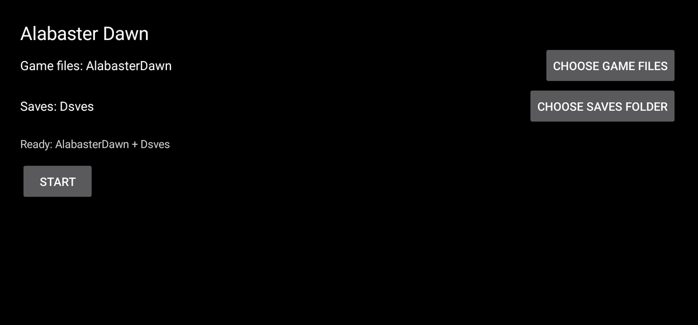
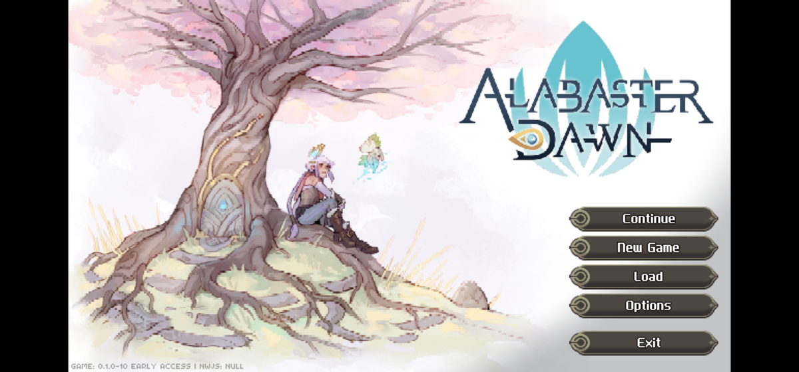

# Alabaster Dawn on Android — unofficial port + controller fix

Two independent pieces of work for [Alabaster Dawn](https://store.steampowered.com/app/3110760/)
(Radical Fish Games, Early Access):

1. **A native Android port** (`android/`) — runs the game in an Android WebView with no Wine, no
   Box64 and no NW.js, reading your own game files from a folder you pick, playing through a
   physical controller read natively from `InputDevice`, and keeping saves in a second folder you
   pick, in the Steam build's own layout.
2. **A controller fix for the desktop build** (`fix/`) — repairs how the game decodes gamepads on
   Linux and inside Wine containers (GameNative / Winlator / Proton).

Plus the research notes (`FINDINGS.md`) and the test harness (`tools/`, `logs/`) that produced them.

| Setup screen | Running under the port |
|---|---|
|  |  |

*Screenshot contains Alabaster Dawn artwork and text, © Radical Fish Games, shown for documentation.*

---

## Android port

### What works today

* Boots the unmodified game to its title screen — **no game file is ever edited**; everything is
  injected at document start and served from the APK.
* Game files are read through the **Storage Access Framework** from a folder you pick (read-only).
  The APK requests **no permissions at all**.
* Saves are written to a **second SAF folder** you pick, using the Steam layout
  (`Saves/Default/Save_ID_0000.save`, `Saves/Default/System.save`, `Saves/Backups/`, `Saves/Backups2/`),
  so a save folder can be copied in from the desktop and copied back out.
* Gamepad: Android `InputDevice` → W3C-standard gamepad for the engine. Left/right stick, d-pad,
  face buttons, shoulders, analog and digital triggers, start/select.
* Resolution can be raised in-game: `640x360 / 960x540 / 1280x720 / 1920x1080 / 2560x1440`.
* Leaving the app pauses the game: the music stops and the loop stops burning CPU. An Android
  WebView never dispatches the page's `blur`/`focus` (which is how the engine knows it lost the
  foreground), so the port dispatches them on `onPause`/`onResume`.
* Immersive fullscreen, screen kept awake, renderer crashes recovered by rebuilding the WebView.

Verified end-to-end on **Samsung Galaxy S22 Ultra (SM-S908U1), Android 16 (API 36)**, with a
Switch Pro Controller: title screen, in-game input, save rotation (`Default` → `Backups` →
`Backups2`), `System.save` round-trip, and options persisted.

### Download

Grab `AlabasterDawn-Android-<version>.apk` from
[Releases](https://github.com/moronigranja/alabaster-android/releases) (allow "install unknown
apps" for your browser or file manager). Every release is signed by **this project's own release
certificate** — `CN=Alabaster Dawn Android port, O=moronigranja, C=BR`, SHA-256
`ab31dd8874bf28fb06c783c8df0d3f6abeec719240165605ce27070e676b9604` — so you can confirm what you
install:

```bash
apksigner verify --print-certs AlabasterDawn-Android-0.1.apk   # no SDK? keytool -printcert -jarfile …
```

The APK carries `assets/LICENSE` + `assets/NOTICE.md` inside, so the binary ships the notices it is
distributed under. Installing it over a build signed with a different key (a local debug build,
say) needs an uninstall first.

### Not in this milestone

* No on-screen touch controls (phase 2).
* The in-game **Load** list was not eyeballed (needs a manual save); everything underneath it —
  file naming, rotation, metadata, `mtime` — is verified.
* Performance is GPU-bound; see the ledger below before expecting 1080p.

### Requirements

* JDK 17, Android SDK with **platform 36** and **build-tools 36.0.0**.
* Phone or tablet on **Android 8.0+** (`minSdk 26`).
* A Bluetooth/USB controller.
* Your own copy of the game (Steam). Its files are **not** distributed here.

### Build and install

```bash
cd android
echo "sdk.dir=$ANDROID_HOME" > local.properties      # or point it at your SDK
./gradlew :app:assembleDebug
adb install -r app/build/outputs/apk/debug/app-debug.apk
```

Unit tests (gamepad mapping and state):

```bash
cd android && ./gradlew :app:testDebugUnitTest
```

Publishing a signed release (maintainers): the release keystore lives **outside** the repo and is
wired through the gitignored `android/keystore.properties`; clones without that file still build,
but the release variant comes out unsigned.

```bash
keytool -genkeypair -keystore ~/.android/alabasterdawn-release.jks -alias alabasterdawn \
  -keyalg RSA -keysize 4096 -validity 10000 -dname "CN=Alabaster Dawn Android port, O=moronigranja, C=BR"
# then android/keystore.properties: storeFile / storePassword / keyAlias / keyPassword (chmod 600)

android/tools/release.sh                       # signed build + digest + signature check
android/tools/release.sh --upload --publish --notes docs/release-notes-0.1.md
```

`tools/release.sh` renames the shipped artifact to `AlabasterDawn-Android-<version>.apk` (never
`app-release-unsigned.apk`, never `app-debug.apk`) and runs the digest and signature checks on that
exact file. Back the keystore and `keystore.properties` up off-machine: losing them locks updates
on every device that installed a build signed with them.

### First run

Copy the game to the phone — the picked folder must contain a `terra/` child:

```bash
adb shell mkdir -p /sdcard/Download/AlabasterDawn
adb push "<steam>/steamapps/common/Alabaster Dawn/terra" /sdcard/Download/AlabasterDawn/terra
```

Optionally copy your desktop saves in (this is the import path):

```bash
adb shell mkdir -p /sdcard/Documents/AdaSaves
adb push "$HOME/.config/Alabaster Dawn/Saves" /sdcard/Documents/AdaSaves/
```

Then: **CHOOSE GAME FILES** → `Download/AlabasterDawn`, **CHOOSE SAVES FOLDER** →
`Documents/AdaSaves`, **START**. The first launch indexes the tree (~2 650 files, a few seconds);
afterwards both folders are remembered and it is one tap. The selected saves folder gains
`Saves/{Default,Backups,Backups2}` on first boot.

Exporting a save is a plain file copy, and the files are drop-in portable back to Steam.

### Resolution and performance

Measured on the S22 Ultra (Snapdragon 8 Gen 1, Adreno 730), `gpubusy` sampling:

| In-game resolution | GPU busy | Frame rate |
|---|---|---|
| 640×360 | 54 % (52.9–54.3) | 59.9 fps sustained (p50 16.7 ms) |
| 960×540 | 91 % | 60 fps sustained |
| 1280×720 | 99.9 % (saturated) | 38–42 fps cool, 19–21 fps hot |

Thermals, not CPU, are the limit: the same 720p scene measured 42 fps cool and 19–21 fps with
`Thermal Status: 3` / 45 °C skin. Don't charge while playing; `640×360` is the safe default,
`960×540` the sharpest resolution that still holds 60.

### How it works (short)

* `WebViewAssetLoader` serves the picked tree in-process from `https://appassets.androidplatform.net/game/`;
  a tree index built once makes the game's ~1 240 per-boot `.flac` probes instant 404s.
* `WebViewCompat.addDocumentStartJavaScript` injects `assets/ada-shim.js` before the page's own
  scripts: a `require`/`nw` shim plus the device-specific workarounds the game needs on Android's
  WebView GL stack (no `OES_draw_buffers_indexed`, a dead shader attribute the Adreno driver
  rejects) and the resolution ladder.
* `AdaBridge` exposes the pad (`getGamepadJson()`) and the file calls used for saves; `FsBridge`
  maps the engine's `/saves` namespace onto the picked saves tree and keeps the Steam file names
  exactly (create-or-overwrite, never a deduplicated `Save_ID_0000 (1).save`).
* `FINDINGS.md` documents the measurements, the dead ends and the reason for every patch.

---

## Desktop controller fix

The game decodes a gamepad that Chromium reports with `mapping != "standard"` using a raw
DirectInput/hat layout **only when `os == LINUX`**; elsewhere (i.e. Wine: GameNative, Winlator,
Proton) it uses the standard layout for a pad that is not in standard order. Either way some pads
end up mis-mapped — the same class of bug as
[nwjs#7006](https://github.com/nwjs/nw.js/issues/7006) for CrossCode.

`fix/gamepad-fix.js` hands the engine pads that really are in W3C standard order, so its standard
table is always correct. Where Chromium sees no pad at all — Windows Chromium reads gamepads only
through XInput, which GameNative's virtual pad never reaches — it synthesizes a standard pad from
GameNative's 64-byte shared-memory struct.

```bash
fix/install.sh                        # auto-detect the Steam install
fix/install.sh --game-dir "/path/to/Alabaster Dawn"
fix/install.sh --mapping standard     # leave Chromium's pads untouched
fix/install.sh --mapping dinput       # always re-decode raw DirectInput pads
fix/install.sh --revert               # undo (restores index.html)
node fix/test-gamepad-fix.mjs         # smoke tests, no game needed
```

The installer backs up `terra/index.html` and copies `gamepad-fix.js` + `gamepad-fix.json` next to
it; `--revert` (or verifying files in Steam) removes the patch. Diagnostics: set `"debug": true`
in `gamepad-fix.json`, or use `fix/gpf-diagnose.js` and `tools/inpage-probe.js`.

> The Android port does **not** need this fix: it feeds the engine a real W3C-standard pad, so the
> engine's standard table is used (this is why the port has no mapping bug).

---

## Repo layout

```
android/    the port (Gradle root + :app; Kotlin, no permissions, one runtime dependency)
            tools/release.sh builds, verifies and publishes the signed APK
docs/       screenshots used by this README, plus the release notes for each version
fix/        controller fix for the desktop / Wine build (installer, config, tests, diagnosis)
tools/      measurement harness: uinput virtual gamepad, in-page probe, fast static server,
            the Node/NW.js browser shim that proved the port feasible
logs/       raw diagnostic logs captured inside GameNative (evidence for FINDINGS.md)
FINDINGS.md research notes: the controller bug, the boot requirements, the port design,
            the performance ledger, and the dead ends not worth retrying
NOTICE.md   attribution: what the game is, what ships inside the APK, what was not copied
LICENSE     MIT (this repository's own code and documentation only)
```

## Legal

* **Alabaster Dawn is © Radical Fish Games.** This repository is an unofficial, non-commercial
  interoperability project. It is not affiliated with or endorsed by Radical Fish Games.
* **No game files, assets or code are distributed here.** You need your own legitimately purchased
  copy; the port reads it from a folder you choose and never modifies it. The desktop installer
  patches a copy in your own installation and can revert itself.
* "Alabaster Dawn", "CrossCode" and the associated logos are trademarks of their owners, used here
  descriptively. Screenshots in `docs/` show the game running for documentation purposes.
* Saves remain yours, in a folder you control.

## License

The code and documentation in this repository are **MIT** licensed — see [LICENSE](LICENSE), and
[NOTICE.md](NOTICE.md) for the game/third-party attribution. MIT requires its notice to travel with
copies of the software, so the released APK carries both files inside itself as `assets/LICENSE`
and `assets/NOTICE.md` (copied at build time from the repo root, one source of truth).
This covers this repository's own source only, not the game and not the third-party components
below. If you would rather have a copyleft or patent-granting license, swapping `LICENSE` is the
only change needed (at which point the sub-projects here follow automatically).

## Credits and third-party components

* **Radical Fish Games** — Alabaster Dawn, and the engine lineage (`terra`) it shares with CrossCode,
  whose explicit browser platform path is what makes this port possible.
* **[AndroidX WebKit](https://developer.android.com/jetpack/androidx/releases/webkit)** — Apache-2.0
  (`WebViewAssetLoader`, `addDocumentStartJavaScript`).
* **[Gradle](https://gradle.org/)** — the wrapper (`android/gradle/wrapper/`) is Apache-2.0,
  © Gradle, Inc.
* **[CrossAndroid](https://gitlab.com/Namnodorel/crossandroid)** — prior art for running this engine
  on Android; that project ships **no license** (all rights reserved), so nothing was copied from
  it. It informed the architecture only, and this port is an independent implementation.
* **[nwjs#7006](https://github.com/nwjs/nw.js/issues/7006)** — independent report of the same
  controller-mapping bug class in CrossCode.
* GameNative / Winlator / Proton — the Wine containers the desktop fix targets.
