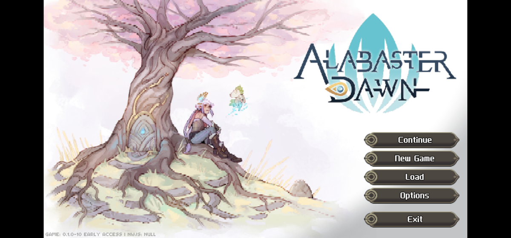
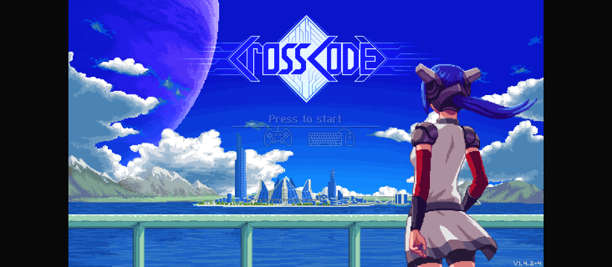
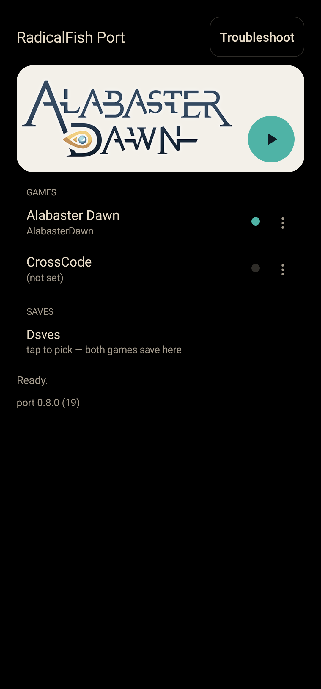
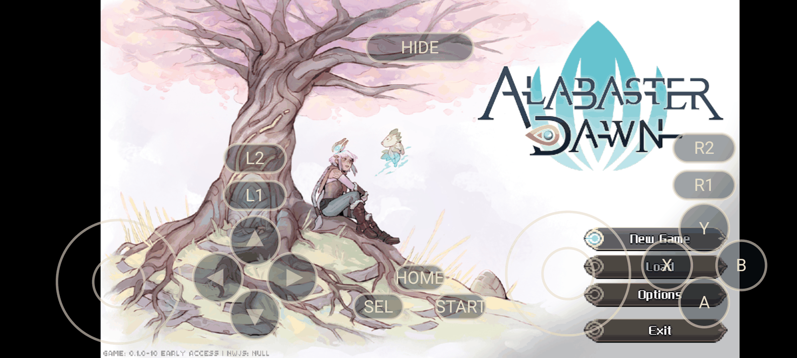
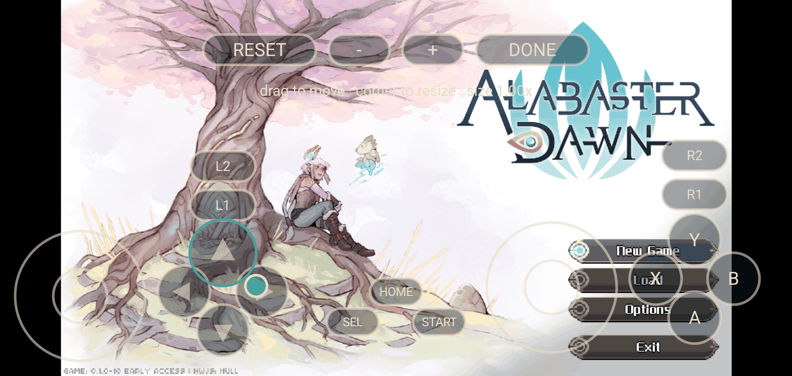
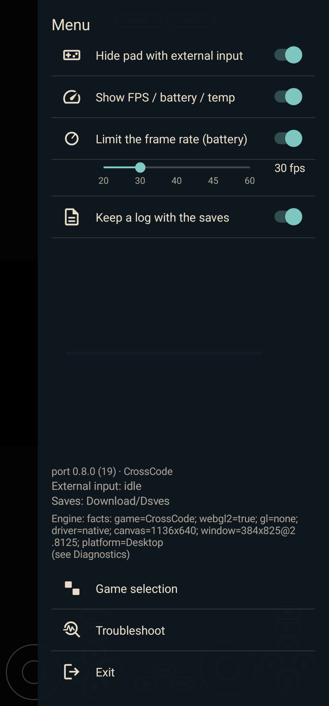
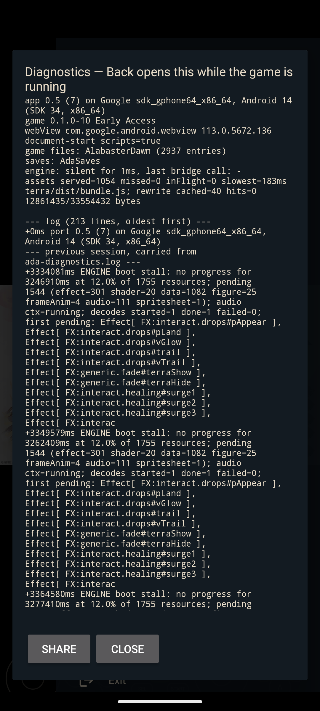

<a id="readme-top"></a>

<!-- PROJECT SHIELDS -->

[![MIT License][license-shield]][license-url]
[![Platform][platform-shield]][platform-url]
[![Games][games-shield]][games-url]

<br />
<div align="center">
  <h3 align="center">RadicalFish Port</h3>

  <p align="center">
    An unofficial Android port for Radical Fish Games' NW.js titles.
    <br />
    Runs <b>Alabaster Dawn</b> and <b>CrossCode</b> from the copy of the game you already own — no Wine,
    no Box64, no PC.
    <br />
    <br />
    <a href="docs/alabaster-dawn-port.md"><strong>Alabaster Dawn &amp; controller-fix docs »</strong></a>
    &middot;
    <a href="FINDINGS.md"><strong>Research notes »</strong></a>
    &middot;
    <a href="https://github.com/moronigranja/alabaster-android/issues">Report Bug</a>
    &middot;
    <a href="https://github.com/moronigranja/alabaster-android/issues">Request Feature</a>
  </p>
</div>

---

<details>
  <summary>Table of Contents</summary>
  <ol>
    <li>
      <a href="#about-the-project">About The Project</a>
      <ul>
        <li><a href="#game-support">Game support</a></li>
        <li><a href="#how-it-works">How it works</a></li>
        <li><a href="#the-controller-fix">The controller fix</a></li>
        <li><a href="#built-with">Built With</a></li>
      </ul>
    </li>
    <li>
      <a href="#getting-started">Getting Started</a>
      <ul>
        <li><a href="#prerequisites">Prerequisites</a></li>
        <li><a href="#building">Building</a></li>
        <li><a href="#installing">Installing</a></li>
      </ul>
    </li>
    <li>
      <a href="#usage">Usage</a>
      <ul>
        <li><a href="#game-files-and-saves">Game files and saves</a></li>
        <li><a href="#input">Input</a></li>
        <li><a href="#the-side-menu">The side menu</a></li>
        <li><a href="#diagnostics">Diagnostics</a></li>
      </ul>
    </li>
    <li><a href="#repository-layout">Repository layout</a></li>
    <li><a href="#roadmap">Roadmap</a></li>
    <li><a href="#contributing">Contributing</a></li>
    <li><a href="#license">License</a></li>
    <li><a href="#acknowledgments">Acknowledgments</a></li>
  </ol>
</details>

---

<!-- ABOUT THE PROJECT -->

## About The Project

| Alabaster Dawn, running under the port | CrossCode, booting under the port |
|---|---|
|  |  |

This repository is an Android **WebView host** for the NW.js games of Radical Fish Games, plus a
desktop **controller fix** for the same games' PC builds. The port reads the game files from a folder
you pick with the Storage Access Framework, injects a per-game compatibility shim at document start,
and serves the tree to the page from the APK — **the game's files are never edited**. Saves go to a
second folder you pick, in a layout a desktop install can read.

The port's own chrome is shared by both games: an on-screen pad with a layout editor, native gamepad
support, mouse and keyboard passthrough, a side menu, and a diagnostics record built for the failure
mode this kind of port actually meets — a device nobody here owns. What differs per game is one data
table (`GameProfile`) and one shim script each.

### Game support

| Game | Engine | Status |
|---|---|---|
| **Alabaster Dawn** (Early Access) | `terra` engine, `terra/index.html` | Boot to title screen and gameplay verified end-to-end on Samsung Galaxy S22 Ultra (Android 16), Galaxy Z Fold 7 (Android 17) and an Android 14 emulator — controller, on-screen pad, saves `Default` → `Backups` → `Backups2`, options, exit. The full detail is in [`docs/alabaster-dawn-port.md`](docs/alabaster-dawn-port.md). |
| **CrossCode** 1.0.0 (`v1.4.2-4`) | Cubic Impact 0.5, `assets/node-webkit.html` | Boots to its title screen with `cc-shim.js`: `ig.platform == Desktop`, `ig.engineName == "Cubic Impact (0.5)"`, canvas `1136x640`, 0 page exceptions, extensions list empty — verified in a desktop Chromium harness on 2026-10-04 (`tools/game-harness.py`; the screenshot above is that run). **Device verification, audio and save round-trips are still open** — see the Roadmap. |

Saves: Alabaster Dawn's Steam layout (`Saves/Default/…`, `Saves/Backups…`) is written into the picked
saves folder exactly as the desktop build writes it, so a `Saves/` folder can be copied in and back
out. CrossCode builds its own save paths from `nw.gui.App.dataPath` (the port makes that `/saves`), so
its save files land in the same picked folder; its options and a fallback save copy live in the
WebView's `localStorage`.

The app keeps its original `applicationId` (`io.github.moronigranja.alabasterdawn`) and signing key,
so installs of the earlier Alabaster-Dawn-only releases keep updating in place; only the display name
is neutral now that the same app runs two games.

### How it works

* **One host, one profile per game.** `GameProfile` holds everything game-specific: the engine's page
  root and entry page, which shim the page gets, where the game's own version is written, and whether
  the host's engine rewrites apply. The profile is *detected from the picked folder* — the entry page
  is the fingerprint — so switching games is switching folders, and nothing is stored.
* **Two shims, deliberately.** Alabaster Dawn runs the `terra` engine and CrossCode runs Cubic Impact
  0.5; they need opposite platform answers (`window.process` must stay **undefined** for the former to
  take its browser path, and must be an **object** for the latter to take its desktop path). Each shim
  is self-contained rather than sharing a core: the two engines are the only two Radical Fish NW.js
  games, and the device-proven Alabaster shim is left alone.
* **The shim is the Node/NW.js surface.** It implements `require("fs"/"path"/"vm"/"os")`,
  `require("nw.gui")` (CrossCode) or the `nw.*` namespace (Alabaster Dawn), `process`, and the
  greenworks stubs, with `fs` backed synchronously by the app's `@JavascriptInterface` bridge
  (`PortBridge`): the picked game tree read-only, the picked saves folder read-write.
* **One standard pad.** The Kotlin side reads the physical controller from `InputDevice` and emits a
  real W3C standard-layout gamepad; the on-screen pad and a hardware controller feed the *same* state,
  so the engine sees exactly one pad.
* **No permission is requested.** Both folders come from the system document picker, and the APK's
  manifest declares no permissions at all.

### The controller fix

`fix/` repairs how the PC builds decode gamepads on Linux and inside Wine containers
(GameNative / Winlator / Proton) — the "controller does nothing" bug. It is independent of the
Android port and patches a copy inside your own installation, and it can revert itself. See
[`docs/alabaster-dawn-port.md`](docs/alabaster-dawn-port.md) and the `fix/` sources.

### Built With

* [![Kotlin][kotlin-badge]][kotlin-url] — the host: `PortActivity`, the SAF tree index and bridge, the
  on-screen pad, the side menu, diagnostics.
* [![AndroidX WebKit][webkit-badge]][webkit-url] — `WebViewAssetLoader` and document-start scripts.
* [![Gradle][gradle-badge]][gradle-url] — the build.
* Plain JavaScript shims (`android/app/src/main/assets/ada-shim.js`, `cc-shim.js`) — no bundler, no
  shared build step: the file you read in the repo is the file the WebView runs.

<p align="right">(<a href="#readme-top">back to top</a>)</p>

---

<!-- GETTING STARTED -->

## Getting Started

### Prerequisites

* **Android SDK** with platform 36 (`local.properties`' `sdk.dir`, or `ANDROID_HOME`).
* **JDK 17+** (the build targets Java 17; JDK 21 works).
* A **legitimately purchased copy** of the game whose files you want to run. Nothing game-related is
  in this repository or in the APK.

### Building

```sh
cd android
./gradlew :app:assembleDebug     # debug APK at app/build/outputs/apk/debug/
./gradlew :app:testDebugUnitTest # JVM unit tests
node tools/test-shim-diagnostics.mjs   # the shim's own smoke tests
```

A release build is unsigned unless `android/keystore.properties` exists; signing is a local, manual
publishing step (`android/tools/release.sh`), never a repository secret.

### Installing

```sh
adb install -r android/app/build/outputs/apk/debug/app-debug.apk
```

<p align="right">(<a href="#readme-top">back to top</a>)</p>

---

## Usage

| Setup | Running | On-screen pad | Pad layout editor | Side menu | Diagnostics |
|---|---|---|---|---|---|
|  |  |  |  |  |  |

### The entry screen

One screen holds both games. A **hero card** shows the game that will start as **its own art and
nothing else** (read from your copy at runtime, never bundled), with the action as a round badge on its
corner: a play glyph that starts it, or a folder glyph while no folder is pointed at. The card takes
the colour its art was drawn for — Alabaster Dawn's transparent wordmark gets a light tile, CrossCode's
opaque title art gets a card in its own background colour.

Under it, each game has a row with its name, its folder, a ready dot and a **⋮** menu to change or
forget that folder; tapping a row moves the hero to that game. One **saves** folder is shared by both
(each game writes its own files into it).

Picking a folder is how the screen learns which game it is — the entry page is the fingerprint — so
point each game at its folder once and both are one tap away after that. Tapping the wrong row's
Start says which game the folder actually is and files it under that game's row. Troubleshoot and the
port version stay on this screen, because it is the screen every report is taken from.

### Game files and saves

Pick the game's **install folder** — the one holding Alabaster Dawn's `terra/` directory or
CrossCode's `assets/` directory (the folder that also holds the game's own `package.json`). The port
indexes it read-only and never writes to it. Then pick a **saves folder**; the port keeps its own
`pad-layout.json` and its diagnostics log there, next to whatever the game writes.

### Input

* **Controller** — any Android-visible pad; the port decodes it to a W3C standard gamepad.
* **On-screen pad** — both sticks, d-pad, A/B/X/Y, L1/R1, L2/R2, Select/Start/HOME, with a toggle
  pill and an `EDIT` mode (drag to move, corner handle to resize, `-`/`+`, `RESET`, `UNDO`, `DONE`).
  While a controller, mouse or keyboard is in use the whole overlay hides and returns after a minute
  of quiet (a switch in the side menu).
* **Mouse and keyboard** — a mouse click falls through the pad to the WebView, and a keyboard plays
  the game: WASD/arrows, Enter, Escape, Space, Tab, modifiers and F1–F12 are dispatched to the page
  with a real DOM `code`/`key` where Android delivers no scan code — plus the legacy `keyCode`/`which`,
  which Impact-era engines (CrossCode's) index their bindings by.

### The side menu

Back opens a panel over the running game: hide-with-external-input, a frame-rate cap with its rate
slider (20/30/40/45/60 fps), a picture-position choice (Top/Centre/Bottom, where the engine supports
it), an FPS/battery/temperature readout, the saves-folder log switch, the version and status lines,
and Exit. All of it lives in the app's prefs; **Exit ends the app process**, so the next launch is
clean.

### Diagnostics

Troubleshoot opens the record: device, port version, the game's own build version (Alabaster Dawn's
changelog and bundle, CrossCode's changelog), WebView and GL backend, folder and asset counters, the
app's log, and the engine's own console errors. A boot that stops is reported by name (the resources
still pending, grouped by kind), the record is carried across a restart, and it can be shared as text
or kept as `ada-diagnostics.log` in the saves folder.

When a record is not enough, the page's own debugger can be attached to a *released* build — which is
what named CrossCode's stalled loader (FINDINGS §23):

```sh
adb shell settings put global rfport_webview_debug 1     # off again with: settings delete global …
adb forward tcp:9222 localabstract:webview_devtools_remote_$(adb shell pidof io.github.moronigranja.alabasterdawn)
# now chrome://inspect, or any CDP client: Runtime.exceptionThrown / Log.entryAdded / a console
```

<p align="right">(<a href="#readme-top">back to top</a>)</p>

---

## Repository layout

```
android/                        the app
  app/src/main/java/…/alabasterdawn/
    GameProfile.kt              what differs per game (the whole seam)
    PortActivity.kt             the WebView host, SAF pickers, input, side menu
    GameAssetHandler.kt         serves the picked tree under /game/ (+ the engine rewrites)
    PortBridge.kt, FsBridge.kt  the @JavascriptInterface surface the shims call
    Shader*.kt                  Alabaster Dawn's `terra` shader fixes (inert for CrossCode)
  app/src/main/assets/
    ada-shim.js                 the Alabaster Dawn shim
    cc-shim.js                  the CrossCode shim
  tools/                        shim smoke tests and the release script
fix/                            the desktop controller fix (Linux / Wine containers)
tools/                          the desktop harness and probes used to measure the games
  game-harness.py               boots a game in headless Chromium with a shim at document start
FINDINGS.md                     the research record (§13 is the CrossCode probe)
ON_SCREEN_GAMEPAD_PLAN.md       the on-screen pad design
docs/alabaster-dawn-port.md     the Alabaster Dawn port and controller-fix documentation
```

<p align="right">(<a href="#readme-top">back to top</a>)</p>

---

## Roadmap

- [x] Per-game profile seam; Alabaster Dawn's behaviour unchanged
- [x] CrossCode shim: boot to the title screen in a desktop harness
- [ ] CrossCode on a phone: GPU cost at 1136×640, audio, fullscreen/scale, pad mapping
- [ ] CrossCode save round-trip (save-string export, and the file path list)
- [ ] CrossCode extensions (`assets/extension`) if mods are wanted
- [ ] Extract a shared shim core if a third game ever appears

See the [open issues](https://github.com/moronigranja/alabaster-android/issues) for the full list of
proposed features and known issues.

<p align="right">(<a href="#readme-top">back to top</a>)</p>

---

## Contributing

Issues and pull requests are welcome. Hardware reports are the most valuable contribution there is:
this port's hard bugs have all been found on devices the maintainer does not own, and the diagnostics
panel exists so that a screenshot of it is a complete report.

1. Fork the project
2. Create your branch (`git checkout -b feature/AmazingFeature`)
3. Commit your changes (`git commit -m 'Add some AmazingFeature'`)
4. Push (`git push origin feature/AmazingFeature`)
5. Open a pull request

<p align="right">(<a href="#readme-top">back to top</a>)</p>

---

## License

Distributed under the MIT License. See [`LICENSE`](LICENSE) for the terms, and [`NOTICE.md`](NOTICE.md)
for the game and third-party attribution the released APK carries.

The games are **not** part of this project: Alabaster Dawn and CrossCode — their artwork, audio, text,
data, code and engines — are © Radical Fish Games. This is an unofficial, non-commercial
interoperability project, not affiliated with, sponsored by, or endorsed by Radical Fish Games.

<p align="right">(<a href="#readme-top">back to top</a>)</p>

---

## Acknowledgments

* [Radical Fish Games](https://www.radicalfishgames.com/) — for the games, and for shipping them as
  ordinary web applications, which is the only reason any of this is possible.
* [CrossAndroid](https://gitlab.com/Namnodorel/crossandroid) — prior art for running CrossCode on
  Android; that project declares no license, so no code was taken from it.
* [Best-README-Template](https://github.com/othneildrew/Best-README-Template) — the structure of this
  document.
* [AndroidX WebKit](https://developer.android.com/jetpack/androidx/releases/webkit) and
  [Material Symbols](https://fonts.google.com/icons) — the libraries and the menu icons.

<p align="right">(<a href="#readme-top">back to top</a>)</p>

---

<!-- MARKDOWN LINKS & IMAGES -->

[license-shield]: https://img.shields.io/github/license/moronigranja/alabaster-android.svg?style=for-the-badge
[license-url]: LICENSE
[platform-shield]: https://img.shields.io/badge/Android-8.0%2B-3ddc84?style=for-the-badge&logo=android&logoColor=white
[platform-url]: android
[games-shield]: https://img.shields.io/badge/games-Alabaster%20Dawn%20%2B%20CrossCode-00599c?style=for-the-badge
[games-url]: #game-support
[kotlin-badge]: https://img.shields.io/badge/Kotlin-7f52ff?style=for-the-badge&logo=kotlin&logoColor=white
[kotlin-url]: https://kotlinlang.org/
[webkit-badge]: https://img.shields.io/badge/AndroidX%20WebKit-3ddc84?style=for-the-badge&logo=android&logoColor=white
[webkit-url]: https://developer.android.com/jetpack/androidx/releases/webkit
[gradle-badge]: https://img.shields.io/badge/Gradle-02303a?style=for-the-badge&logo=gradle&logoColor=white
[gradle-url]: https://gradle.org/
